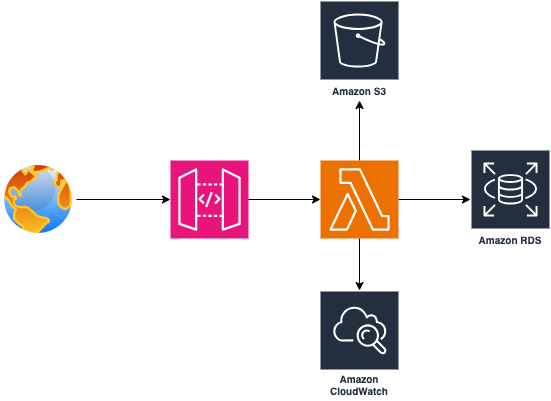
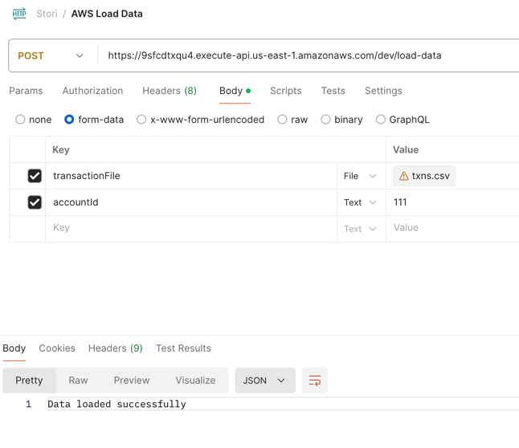
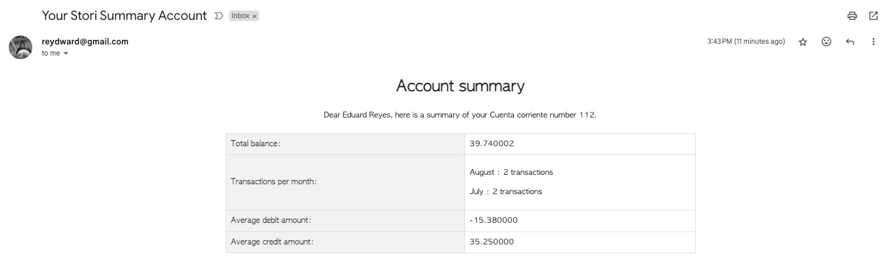

# Stori Account Summary
This API process a csv transactions file and send summary information to a user email.

# Architecture


# Technologies
- Golang
- REST API
- AWS RDS PostgreSQL
- AWS Lambda
- AWS API Gateway
- Testify
- MockGen
- go-sqlmock
- Gomail

# API REST
### `POST /load-data`
Endpoint to load a csv file with transactions. The request should be a `multipart/form-data` with a file field and the account id. 

The request should have the "transactionFile" and the "accountId" like the image below shows.


The response shows the result of the process.

```json
{
  "Message": "Data loaded successfully"
}
```

You can test this endpoint here: https://9sfcdtxqu4.execute-api.us-east-1.amazonaws.com/dev/load-data


### `POST /summary`
This endpoint sends an email with the summary of the transactions for the account id. This is how the email looks like:


The request should have the following body:
```json
{
  "user": 80208352,
  "accountId": 112
}
```
The response shows the result of the process and the summary information.

```json
{
  "user": {
    "id": 80208352,
    "name": "Eduard Reyes",
    "email": "reydward@gmail.com"
  },
  "account": {
    "id": 112,
    "userId": 80208352,
    "name": "Cuenta corriente"
  },
  "totalBalance": 39.74,
  "numberOfTransactions": [
    {
      "Month": "August   ",
      "TransactionCount": 2
    },
    {
      "Month": "July     ",
      "TransactionCount": 2
    }
  ],
  "averageDebitAmount": -15.38,
  "averageCreditAmount": 35.25,
  "statusMessage": "Email sent successfully"
}
```

You can test this endpoint here: https://9sfcdtxqu4.execute-api.us-east-1.amazonaws.com/dev/summary

# Instructions

### Packages
The project packages are structured in this way:
```
db: Database schema
load-data: Lambda function to load the csv file
    internal
        database: Connection to the database
        file: S3 file operations
        handler: Lambda function handler and HTTP handler
        model: Domain entities
        repository: Repository pattern implementation
        service: Business logic
        
summary: Lambda function to send the summary email
    internal
        constants: Constants used in the project
        database: Connection to the database
        handler: Lambda function handler and HTTP handler
        model: Domain entities
        repository: Repository pattern implementation
```
### Unit Tests
From a terminal execute the following command to run the unit test:
```
go test ./...
```

### Verify the coverage
In order to generate an HTML coverage report, from a terminal execute the following commands:
```
go test -coverprofile c.out ./...
go tool cover -html c.out
```

### Last notes
Please reach out if you have any questions regarding the solution for the assignment.
```
Email: reydward@gmail.com
Mobile: +573168284844
```